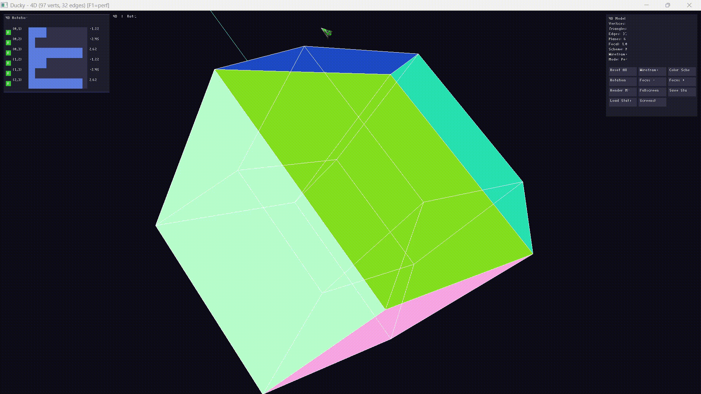

# Ducky



A real-time N-dimensional object viewer that renders hyperdimensional geometry through recursive perspective projection.

## Origin

The name "Ducky" comes from the evolution: **4D vectors** → quad-vect → quad-ec → quack → duck → ducky

## Overview

Ducky visualizes N-dimensional objects (3D, 4D, 5D, ...) by recursively projecting them down through each dimension (N-D → (N-1)-D → ... → 3D) then into 2D for display. It supports full N-D rotation and translation with real-time rendering using OpenGL. The number of dimensions is read from the model file, so any dimension count (3+) works automatically.

## Features

- **N-D Perspective Projection**: Recursively projects N-D geometry down to 3D, then to 2D screen space
- **N-D Rotation**: All N×(N-1)/2 rotation planes controllable via on-screen slider panel or keyboard
- **Per-Plane Auto-Rotate**: Toggle auto-rotation on/off for each individual rotation plane (green A / dark M)
- **GUI Button Panel**: All controls accessible via clickable buttons on the right panel
- **Face-Colored Rendering**: 4 color schemes — Golden ratio, Rainbow, Monochrome, Warm
- **Coordinate Axes**: Visualize all N axes with distinct colors
- **Wireframe Overlay**: Auto-generated edges with depth-independent rendering (toggle with E)
- **Right-Click Orbit**: Intuitive 3D orbit by right-click dragging off the slider panel
- **Slider Panel**: Left-side draggable angle sliders for all rotation planes
- **Frame-Rate Independence**: Auto-rotation speed uses delta-time
- **Undo/Redo**: Full undo (Ctrl+Z) and redo (Ctrl+Shift+Z) for all rotation and translation changes
- **Save/Load State**: Persist camera state to disk (Ctrl+S / Ctrl+L)
- **Fullscreen Mode**: Toggle fullscreen with F11, restores windowed position within monitor bounds
- **Screenshot**: Timestamped TGA screenshots via F12
- **Performance Overlay**: FPS counter toggle (F1)
- **Custom Model Format**: Simple `.dky` format with `dims N` header for defining N-D meshes
- **Drag-and-Drop**: Drop model files onto the window to load (notification only)
- **Cross-Platform**: Builds on Linux and Windows (via cross-compilation)

## Building

### Prerequisites

- CMake 3.16+
- C++17 compiler
- OpenGL 3.3+
- GLFW (fetched automatically on Windows, system package on Linux)

### Linux

```bash
sudo apt install libglfw3-dev  # Debian/Ubuntu
mkdir build && cd build
cmake ..
make
./ducky [model.dky]
```

### Windows (Native)

Requires CMake and a C++17 compiler. GLFW is fetched automatically.

#### Visual Studio (MSVC)

```powershell
cmake -B build -DCMAKE_BUILD_TYPE=Release
cmake --build build --config Release
build\Release\ducky.exe model.dky
```

#### MinGW (on Windows)

```powershell
cmake -B build -G "MinGW Makefiles" -DCMAKE_BUILD_TYPE=Release
cmake --build build
build\ducky.exe model.dky
```

## Controls

### Keyboard

#### Rotation (N-D Planes)
| Key | Action |
|-----|--------|
| `1` / `2` | Rotate in plane 0-1 |
| `3` / `4` | Rotate in plane 0-2 |
| `5` / `6` | Rotate in plane 1-2 |
| `7` / `8` | Rotate in plane 0-3 |
| `9` / `0` | Rotate in plane 1-3 |
| `-` / `=` | Rotate in plane 2-3 |

For 6D+ models, additional planes are accessible with Ctrl+ letter pairs:
`Q`/`W`, `E`/`R`, `T`/`Y`, `U`/`I`, `O`/`P`, `[`/`]`

#### State Management
| Key | Action |
|-----|--------|
| `Ctrl+Z` | Undo last rotation/translation change |
| `Ctrl+Shift+Z` | Redo |
| `Ctrl+S` | Save camera state to `ducky_state.txt` |
| `Ctrl+L` | Load camera state from `ducky_state.txt` |
| `R` | Reset all rotations, translations, and auto-rotate toggles (undo-friendly) |

#### Display Controls
| Key | Action |
|-----|--------|
| `V` | Cycle auto-rotation preset (all on, all off, alternating, every 3rd) |
| `C` | Cycle color scheme (Golden → Rainbow → Monochrome → Warm) |
| `E` | Toggle wireframe-only mode (edges only, no faces) |
| `[` / `]` | Decrease / increase focal length (perspective depth) |
| `F11` | Toggle fullscreen |
| `F12` | Take timestamped TGA screenshot |
| `F1` | Toggle performance overlay (FPS) |

### Mouse

#### Slider Panel
A left-side panel provides draggable sliders for every rotation plane:

- **Drag the track** to set an angle in [–π, π)
- **Click the toggle square** to toggle per-plane auto-rotation (green `A` = on, dark `M` = off)

#### Button Panel
A right-side panel contains clickable buttons for all actions: Reset, Wireframe, Color, Preset, Focal±, Undo, Redo, Fullscreen, Save, Load, and Screenshot.

#### Right-Click Orbit
Right-click and drag anywhere outside the slider panel to orbit the view (rotates primary rotation planes).

## .dky Model Format

The custom `.dky` format defines N-dimensional meshes with a dimension header, vertices, and faces:

```
dims [N]
// Comments start with //
[p1] [p2] ... [pN] [r] [g] [b]
...
face
[index1] [index2] [index3]
...
```

- **Header**: `dims N` sets the spatial dimension count (must be 3+)
- **Vertices**: N + 3 values per vertex — N position coordinates followed by RGB color
- **Faces**: `face` header followed by triangle indices (0-based)

Example from `model.dky`:
```
dims 4
// Tesseract vertex: x y z w r g b
-0.5 -0.5 -0.5 -0.5 0.0 0.0 0.0

// Face definition
face
0 1 2
```

## Project Structure

```
Ducky/
├── cmake/
│   └── mingw-toolchain.cmake   # MinGW cross-compilation toolchain
├── src/                        # Source files
│   ├── main.cpp                # Main application & rendering loop
│   ├── main.hpp                # Model loading (LoadModel)
│   ├── glad.c                  # OpenGL loader
│   ├── stb_image.h             # Texture loading
│   └── stb_easy_font.h         # Bitmap font rendering
├── shaders/                    # GLSL shaders
│   ├── tesseract.vert/.frag    # 3D→2D projection vertex shader
│   ├── axes.vert/.frag         # Coordinate axes
│   ├── edge.vert/.frag         # Wireframe edges
│   └── text.vert/.frag         # On-screen text
├── include/                    # Headers (GLFW, GLAD, KHR)
├── bin/                        # Compiled binaries
├── model.dky                   # Default 4D model (tesseract, 96 verts)
├── model_5d.dky                # 5D hypercube (penteract, 320 verts)
├── BUGS.md                     # Known bugs and optimization notes
├── CMakeLists.txt              # Build configuration
└── README.md                   # This file
```

## Dependencies

- **GLFW 3.4** — Window management & input (fetched via FetchContent for Windows)
- **GLAD** — OpenGL function loader (included in src/)
- **stb_image** — Texture loading (included in src/)
- **stb_easy_font** — Bitmap font rendering (included in src/)

## License

MIT License — see [LICENSE](LICENSE) for details

## Author

Jlmmbo (2026)
